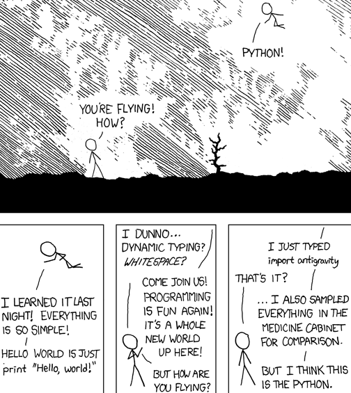
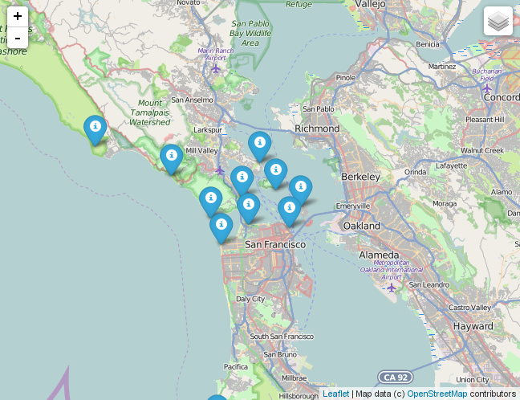

# Slippy maps with folium+leaflet

>- I have a problem
>- I **do not** know JS
>- I **do not want** to learn JS
>- but I love **leaflet** maps...

---

# The notebook that saved me!


[http://nbviewer.ipython.org/gist/wrobstory/1eb8cb704a52d18b9ee8/Up and Down PyData 2014.ipynb](http://nbviewer.ipython.org/gist/wrobstory/1eb8cb704a52d18b9ee8/Up%20and%20Down%20PyData%202014.ipynb)

---

# My anti-gravity moment



---

# My first folium map

```python
import folium

width, height = 650, 500
radars = folium.Map(location=[40, -122], zoom_start=5,
                    tiles='OpenStreetMap',
                    width=width, height=height)

for name, location in locations.items():
    radars.simple_marker(location=location, popup=name)
```

---



---

# The project is under active development

. . .

but we need help!

---

# Examples

- [SECOORA](./notebooks/secoora/mapa.html)
- [OOI](http://nbviewer.jupyter.org/github/ocefpaf/sscsw/blob/master/IOOS_data_demo.ipynb)
- [Boston Light Swim](http://nbviewer.jupyter.org/github/ocefpaf/boston_light_swim/blob/e70bbf6ebb54ed77c3d8ecfd9d8e9f64091d1976/02-create_map.ipynb)

---

# What to expect in the next few months
- leaflet plugins
    - leaflet.time.dimension
    - HeatCanvas
    - AnimatedMarker
    - geoCSV/Shapefile

---

# Thank you!
